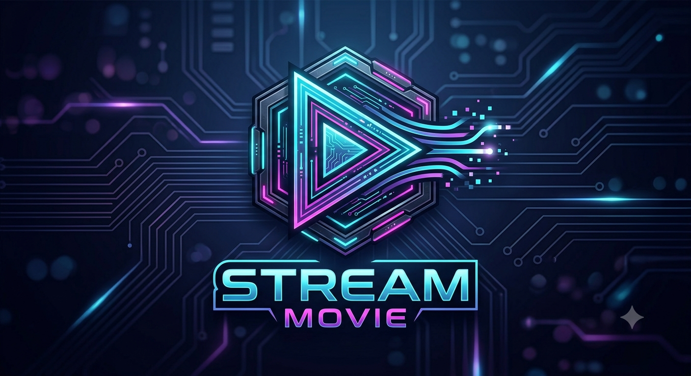

# 🤖 StreamMovies Telegram Bot

<p align="center">
  
</p>

<p align="center">
  <b>A Professional Telegram Bot for Streaming and Managing Video Content.</b>
</p>

<p align="center">


</p>

---

# ✨ Features

- 📹 Upload and manage video content
- 🔍 Smart search with filters (genre, year, tags)
- 👥 Multi-role system (Owner • Admin • User)
- 🔒 Rate limiting & advanced permission management
- 📊 Statistics and analytics dashboard
- 📝 Audit logs
- ⚡ Redis caching
- 🗄️ Supabase PostgreSQL support
- 🐳 Docker ready
- 🚀 Easy cloud deployment

---

# 🛠 Tech Stack

```text
| Technology               | Description               |
|--------------------------|---------------------------|
| Python 3.11+             | Main programming language |
| python-telegram-bot 20.3 | Telegram Bot Framework    |
| Supabase                 | PostgreSQL Database       |
| Redis                    | Cache & Session Storage   |
| Docker                   | Containerization          |
| GitHub Actions           | CI/CD (optional)          |
```

---

# ⚙ Installation

## 1. Clone the Repository

```bash
git clone https://github.com/NOVA-X-Code/Stream-bot.git
cd Stream-bot
```

---

## 2. Create a Virtual Environment

Linux / macOS

```bash
python3 -m venv venv
source venv/bin/activate
```

Windows

```powershell
python -m venv venv
venv\Scripts\activate
```

---

## 3. Install Dependencies

```bash
pip install -r requirements.txt
```

---

## 4. Configure Environment Variables

```bash
cp bot.env.example bot.env
```

Edit **bot.env** and add your credentials.

Example

```env
BOT_TOKEN=
SUPABASE_URL=
SUPABASE_KEY=
REDIS_URL=
OWNER_ID=
```

---

## 5. Start the Bot

```bash
python -m src.bot
```

---

# 🚀 Deployment

## 🐳 Docker

```bash
docker-compose up -d --build
```

---

## ☁ Deploy on Render

[](https://render.com)

1. Fork this repository.
2. Create a new **Background Worker**.
3. Connect your GitHub repository.
4. Add your environment variables.
5. Deploy.

---

## 🚂 Deploy on Railway

[](https://railway.app/new)

1. Fork the repository.
2. Create a new Railway project.
3. Connect GitHub.
4. Configure environment variables.
5. Deploy.

---

## ▲ Deploy on Koyeb

1. Fork the repository.
2. Create a Koyeb App.
3. Connect GitHub.
4. Add your environment variables.
5. Deploy.

---

## 🐧 Deploy on VPS

```bash
git clone https://github.com/NOVA-X-Code/Stream-bot.git

cd Stream-bot

pip install -r requirements.txt

python -m src.bot
```

---

# 🔄 Updating

```bash
git pull

pip install -r requirements.txt

docker-compose up -d --build
```

---

# 🤝 Contributing

Contributions are welcome!

1. Fork the repository
2. Create a feature branch
```bash
git checkout -b feature/MyFeature
```
3. Commit your changes

```bash
git commit -m "Add MyFeature"
```
4. Push your branch
```bash
git push origin feature/MyFeature
```

5. Open a Pull Request

---

# 📜 License

This project is distributed under the **MIT License**.

See the **LICENSE** file for more information.

---

# 🌍 Community & Support

## 📢 Telegram

- 🔷 **Laboking Free Surf**  
  https://t.me/Labokingfreesurf

- 🔷 **Nostra DigitalCenter**  
  https://t.me/Nostra_DigitalCenter

- 🔷 **Hat Tunnel Community**  
  https://t.me/hat_tunnel

---

## 💬 WhatsApp

Official Channel

https://whatsapp.com/channel/0029Vb8ZJnsAYlUHo1uA6W0y

Community Group

https://chat.whatsapp.com/LUkXjJNfWrT8Fz7akxosH0

---

## 🎮 Discord

https://discord.gg/xGAGs69UHj

---

## 📧 Contact

**Author:** NOSTRA
**Email:** contact.nostra237@gmail.com

---

# ⭐ Support the Project

If you find this project useful, consider giving it a ⭐ on GitHub.
It helps the project grow and motivates future development.
> 💡 **Looking for DevOps solutions? ?** Reach out to us now!

---

<p align="center">

Made with ❤️ by <b>NOSTRA<i>(Nova X-Code)</i></b>

</p>
